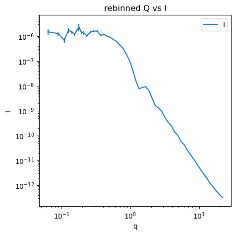
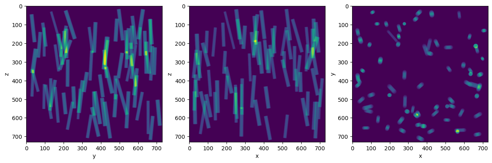
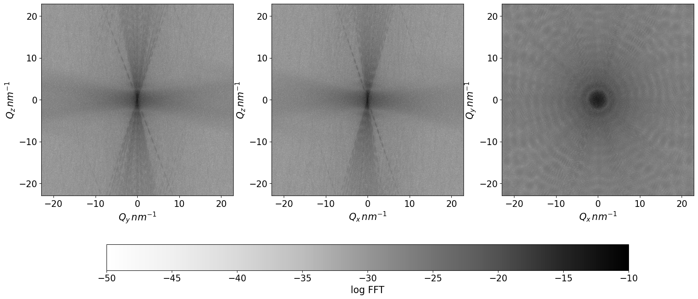

# Compute the forward and inverse problem in X-ray scattering

## Overview
This package implements computation for two problems,which can be found in SAXSsimulations directory:
1. Forward scattering `SAXSforward` - computes high-rsolution 3D Fourier Transform with low memory requirments
2. Inverse scattering `SAXSinverse` - given 1D scattering curve, predicts shape and parameters of the scatterer with an Invertible Neural Network[1], based on [2] Currently only three shapes are supported  


## References
[1] Ardizzone, L., Kruse, J., Wirkert, S., Rahner, D., Pellegrini, E.W., Klessen, R.S., Maier-Hein, L., Rother, C., Köthe, U., 2019. Analyzing Inverse Problems with Invertible Neural Networks. arXiv:1808.04730 [cs, stat].  
[2] Ardizzone, L., Bungert, T., Draxler, F., Köthe, U., Kruse, J., Schmier, R., and Sorrenson, 2018-2022. Framework for Easily Invertible Architectures (FrEIA). [https://github.com/vislearn/FrEIA]


## Requirments:
* mp-pyrho 

## Installation

```
$ git clone https://github.com/sofyalaski/SAXS-simulations.git
$ cd SAXS-simulations
$ pip install .
```

## `SAXSforward` usage examples (1)
Calculate 3D Fourier transform for some 3D density data.   
You will require mp-pyrho package and will first follow their tutorial on how to extract data from vasp files.  
an example density file is taken from [https://github.com/materialsproject/pyrho/tree/main/test_files] 


```python
import numpy as np
import torch
import requests
from pyrho.charge_density import ChargeDensity

import SAXSsimulations.SAXSforward as SAXSforward
from SAXSsimulations.SAXSforward.plotting import *

# save the vasp file locally
url = "https://raw.githubusercontent.com/materialsproject/pyrho/main/test_files/CHGCAR.sc1.vasp"
filename = "data/CHGCAR.sc1.vasp" # set the filename you want to save the file as

response = requests.get(url)

if response.status_code == 200:
    with open(filename, 'w') as f:
        f.write(response.text)
    print(f"File saved as {filename}")
else:
    print(f"Error downloading file. Status code: {response.status_code}")

# follow mp-pyrho tutorial
density = ChargeDensity.from_file(filename)
cden_transformed = density.get_transformed(
    [[1, 1, 0], [1, -1, 0], [0, 0, 1]],
    grid_out=density.grid_shape,
    up_sample=2,
)

trans_data = cden_transformed.normalized_data["total"]
print(
    f"The transformed normalized charge density data is has a range of {trans_data.min():0.3f} --> {trans_data.max():0.3f} e-/Ang^3 and a shape of {trans_data.shape }"
)
```

    File saved as data/CHGCAR.sc1.vasp
    The transformed normalized charge density data is has a range of -0.188 --> 0.570 e-/Ang^3 and a shape of (100, 60, 60)


To use the FT functions you need to create an instance of class `DensityData` from `SAXSforward` and assign the density values to the respective attribute with the methd `set_density`.  
Caution, pass data as a torch tensor. 


```python
# initialize the empty class with FT functionality and assign pre-calculated density attribute
density_f = SAXSforward.DensityData()
density_f.set_density(torch.tensor(trans_data))
```

### Warning
Do not plot the 3D plot if your data has a shape $>256^3$, instead plot the central slice in each direction with function `plot_slices_ft`


```python
# calculate the 3D FT with a custom function and plot it
density_f.pin_memory()
density_f.calculate_custom_FTI(three_d = True, device='cuda') # 3D FT
plot_3D_structure(density_f.FTI,  realspace = False, figsize = 5)
#plot_slices_ft(density_f)
```


    

    


## `SAXSforward` usage examples (2)
Or instead create a simulation by setting the size in nm and number of points in the box and calling a shape function. This will place spheres/ hard cpheres or cylinders into the box. You can also specify the parameters of the cylinder  
For better perfomance choose $2^a \times 3^b \times 5^c \times 7^d$ points in the box


```python
from SAXSsimulations.SAXSforward import  Sphere, Cylinder
# our box will contain 729**3 points and each axis represents 100 nm; spheres will be added until the taken volume fraction is 1%
simulation = Sphere(size = 100, nPoints = 729, volFrac = 0.01)
# spheres will have a radius of 3.4 nm and are allowed to overlap
simulation.place_shape(rMean = 3.4, nonoverlapping=False)
# look at it in 3D iN 5 evenly spaced slices
plot_slices(simulation.density, simulation.grid)
```

    spheres accepted:63 and declined: 0


    

    


Fourier transform it too:  
We can also set the arguments to output the memory it uses by setting `memory_stats` to True. Additionally, you can set the data type to be single or double precision by setting the `dtype` argument to either `torch.complex64` or `torch.complex128`. By default the single precision is set.  
Here we will look at 3D FT from the perspective of each axes central slice


```python
simulation.pin_memory()
memory_density, memory_ft = simulation.calculate_custom_FTI(three_d = True, device = 'cuda', memory_stats = True)
print(f'The memory requirments for the density matrix are {memory_density/1024**3}Gb, for calculating the FT: {memory_ft/1024**3}Gb')
# smooth out each pixel of simulation with *sinc* function and mask the FT to a sphere
simulation.calculate_FTI_sinc_masked()
# look at the 3D FT:
plot_slices_ft(simulation)
```

    The memory requirments for the density matrix are 3.68771679859492e-12Gb, for calculating the FT: 2.000888343900442e-11Gb


    

    


now rebin this into 1D curve ( only makes sense for high-resolution data)


```python
simulation.reBin(150, for_sas=True)
simulation.drop_first_bin()
plot_Q_vs_I(simulation.binned_slice, figsize = 5)
```


    

    


Fit our simulation against analytical solution generated with SasView


```python
# compare against SasView:
simulation.init_sas_model()
# fit the scaling factor to match
simulation.optimize_scaling()
# compare
plot_simulation_vs_sas( simulation)
```

    relative error: 0.79


    

    


Similarly do the same for cylinder:


```python
simulation = Cylinder(size = 100, nPoints = 729, volFrac = 0.01)
simulation.place_shape(rMean = 1.46, hMean = 21.4, theta = 10)
# look at the 2D maping of the cimulation from each perspective
plt_slices_sum(simulation)
```

    volume fraction is 0.01000, height is 23.362, radius is 1.488, center at (21.6,18.1,-47.7), rotation phi is 47, rotation theta is 10 


    

    


```python
# calculate 3D FT and look at it
simulation.pin_memory()
simulation.calculate_custom_FTI(three_d = True, device = 'cuda')
plot_slices_ft(simulation)
```


    

    


rebin 3D FT, and fit against the analytical solution


```python
simulation.reBin(151)
simulation.init_sas_model()
simulation.optimize_scaling()

plot_simulation_vs_sas( simulation)
```

    relative error: 1.99


    

    


## Compute the inverse problem in scattering with `SAXSinverse`

Given a scattering curve in 1D infer the shape, radius, polydispersity and further parameters of the scatterer.   

A pretrained model is available in the results directory. Given a scattering curve with 512 points in it it can predict the shape (choice between "sphere", "hard sphere" and "cylinder"), radius and polydispersity of radius in nm' for shapes predicted to be hard spheres it will predict the volume fraction and for shapes predicted to be cylinders it will predict the length and polydispersity of cylinder.


In the `scripts/create_data.py` you can find functions for creating training data for the three shapes. One can create more data with Sasmodels.   
However, when creating your training data keep in mind that it should be balanced. 


```python

from SAXSsimulations.SAXSinverse.utils import ScatteringProblem
import numpy as np
import torch
import torch.nn as nn
import FrEIA.framework  as Ff
import FrEIA.modules as Fm

```

### Step 1: Define Hyperparameters


```python
#define some hyperparameters

# where to put the model
filename_out    = 'results/ML_output/inn.pt'
# Compute device to perform the training on, 'cuda' or 'cpu'
device          = 'cuda'

#######################
#  Training schedule  #
#######################

# Initial learning rate
lr_init         = 2e-3
#Batch size
batch_size      = 128
# Total number of epochs to train for
n_epochs        = 200

# End the epoch after this many iterations (or when the train loader is exhausted)
n_its_per_epoch = 200
# For the first n epochs, train with a much lower learning rate. This can be
# helpful if the model immediately explodes.
pre_low_lr      = 0
# Decay exponentially each epoch, to final_decay*lr_init at the last epoch.
final_decay     = 0.02
# L2 weight regularization of model parameters
l2_weight_reg   = 1e-5
# Parameters beta1, beta2 of the Adam optimizer
adam_betas = (0.9, 0.95)

#####################
#  Data dimensions  #
#####################
# we want the input dimension [x] be of the same size as [y,z], or with the padding: [x, padd_x] = [y,z,pad_yz]
# the dimension of inputs [x] is defined with your data; shape and radius are one-hot-encoded, meaning if you i.g. have in total 6 properties (two of them are shape and radius) describing the total of 3 properties, 
# your input dim [x] = 10
ndim_pad_x = 522

ndim_y     = 512
ndim_z     = 2
ndim_pad_zy = 18 


############
#  Losses  #
############
# id you want to add the reconstruction loss: l2 between reverse pass from sampled curves and sampled scatterer properties
train_reconstruction = False

# penalty for loss functions
lambd_fit_forw         = 0.01 
lambd_mmd_forw         = 100
lambd_mmd_back         = 500
lambd_reconstruct      = 1.

# Both for fitting, and for the reconstruction, perturb y with Gaussian 
# noise for scattering curves is zero, because we added it when creating the data
add_y_noise     = 0 
# For reconstruction, perturb z 
add_z_noise     = 2e-2
# In all cases, perturb the zero padding
add_pad_noise   = 1e-2

# For noisy forward processes, the sigma on y (assumed equal in all dimensions).
# This is only used if mmd_back_weighted of train_max_likelihoiod are True.
y_uncertainty_sigma = 0.12 * 4

# kernels for MMD, crucial for convergence
mmd_back_weighted = True
mmd_forw_kernels = [(0.2, 1/2), (1.5, 1/2), (3.0, 1/2)]
mmd_back_kernels = [(0.2, 1/2), (0.2, 1/2), (0.2, 1/2)]

###########
#  Model  #
###########

# Initialize the model parameters from a normal distribution with this sigma
init_scale = 0.10
# n blocks in the RNVP
N_blocks   = 5
#
exponent_clamping = 2
#
hidden_layer_sizes = 32
# should always be true for RNVP
use_permutation = True
#
verbose_construction = False
# the flow of the network
flow = 'inverse'

```

### Step 2: Create instance of the class


```python
# define instance of the class
lp = ScatteringProblem(filename_out, device, lr_init, batch_size, n_epochs, n_its_per_epoch, pre_low_lr, final_decay, l2_weight_reg, adam_betas, ndim_pad_x, ndim_y, ndim_z, ndim_pad_zy , train_reconstruction, lambd_fit_forw , 
                       lambd_mmd_forw, lambd_mmd_back, lambd_reconstruct, add_y_noise , add_z_noise, add_pad_noise, y_uncertainty_sigma,mmd_forw_kernels, mmd_back_kernels, mmd_back_weighted, init_scale, flow)
```

### Step 3: Read the data you will be predicting and Normalize data


When reading in the data you need to pass a path to directory where the training data in HDF format is contained, the total number of shapes the training data contains and the list with names of all parameters as in the HDFs. 
Addiionally, the first two parameters MUST be shapes and radius as they are present in all shapes andare most ambigous. They will be represented as one-hot data.  


```python

lp.read_data('data/simulations',shapes = 3, input_keys = ['shape', 'radius', 'radius_pd','length', 'length_pd',  'volfraction'])
lp.normalize_inputs()

```

    <HDF5 file "15000.nxs" (mode r)>


```python
lp.shapes_dict
```


    {'cylinder': 0, 'sphere': 1, 'hardsphere': 2}


### Step 4: Define model


```python
def subnet(dims_in, dims_out):
    return nn.Sequential(nn.Linear(dims_in, hidden_layer_sizes*2), nn.ReLU(),
                        nn.Linear(hidden_layer_sizes*2,  hidden_layer_sizes), nn.ReLU(),
                        nn.Linear(hidden_layer_sizes,  dims_out))

input = Ff.InputNode(lp.ndim_x + ndim_pad_x, name='input')


nodes = [input]
for i in range(N_blocks):
    nodes.append(Ff.Node(nodes[-1].out0, Fm.RNVPCouplingBlock, {'subnet_constructor':subnet, 'clamp':exponent_clamping}, name = 'coupling_{}'.format(i)))
    if use_permutation:
        nodes.append(Ff.Node([nodes[-1].out0], Fm.PermuteRandom, {'seed':i}, name='permute_{}'.format(i)))

nodes.append(Ff.OutputNode([nodes[-1].out0], name='output'))
model = Ff.GraphINN(nodes, verbose=verbose_construction)
```

### Step 5: Set the model and the optimizer 


```python

lp.set_model(model)
lp.set_optimizer()
```

### Step 6: Load the pretrained model
Make sure that the shape dictionary saved in the same place, where the model is. is an agreement with your data, as well as the list of properties names in step 3. The predictions will work, but the table for comparison between true and sampled might be off, as well as visualizations. 


```python

lp.load(filename_out)
```

### Step 7: Predict outcomes;
we  first will create some subset of the data to predict the data on 


```python
subset = torch.tensor(np.random.choice(15000, 200))
scattering_curves = torch.index_select(lp.labels, 0, subset) 
scatterers = torch.index_select(lp.inputs, 0, subset) 
```


```python
predictions = lp.predict(scattering_curves, 3)
```


```python
outcomes = lp.create_table_from_outcomes(predictions, scatterers)
```


```python
# some visualization methods
from SAXSsimulations.SAXSinverse.visualizations import plot_outcomes_identified, describe_false_shapes, describe_positive_shapes
```


```python
plot_outcomes_identified(outcomes, 'test', filename_out.split('.pt')[0]+'_shapes.txt', path = None)
```

    Accuracy is 97.00%
    [90.625, 100.0, 100.0]
    MSE for radius per shape for correctly identified instances as follows: sphere: 0.0039, hardsphere: 0.0059 and cylinder: 0.1256
    MSE for radius polydispersity per shape for correctly identified instances as follows: sphere: 0.0005, hardsphere: 0.0001 and cylinder: 0.0002
    MSE for cylinder length for correctly identified instances: 0.0042
    MSE for cylinder length polydispersity for correctly identified instances: 0.0000
    MSE for cylinder length for correctly identified instances: 0.0000


    

    


## Alternatively you can train your own model. For that you will need to add some additional steps:
* Step 3.5 create loaders
* Step 6 training the model


```python
lp = ScatteringProblem(filename_out, device, lr_init, batch_size, n_epochs, n_its_per_epoch, pre_low_lr, final_decay, l2_weight_reg, adam_betas, ndim_pad_x, ndim_y, ndim_z, ndim_pad_zy , train_reconstruction, lambd_fit_forw , 
                       lambd_mmd_forw, lambd_mmd_back, lambd_reconstruct, add_y_noise , add_z_noise, add_pad_noise, y_uncertainty_sigma,mmd_forw_kernels, mmd_back_kernels, mmd_back_weighted, init_scale, flow)


lp.read_data('data/simulations',shapes = 3, input_keys = ['shape', 'radius', 'radius_pd','length', 'length_pd',  'volfraction'])
lp.normalize_inputs()
## new
lp.create_loaders()
##

lp.set_model(model)
lp.set_optimizer()
#lp.train()
```

    <HDF5 file "15000.nxs" (mode r)>
