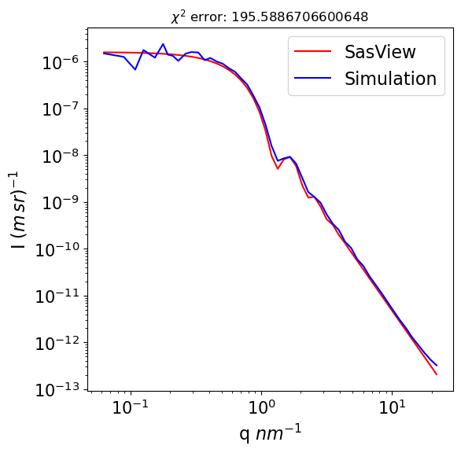
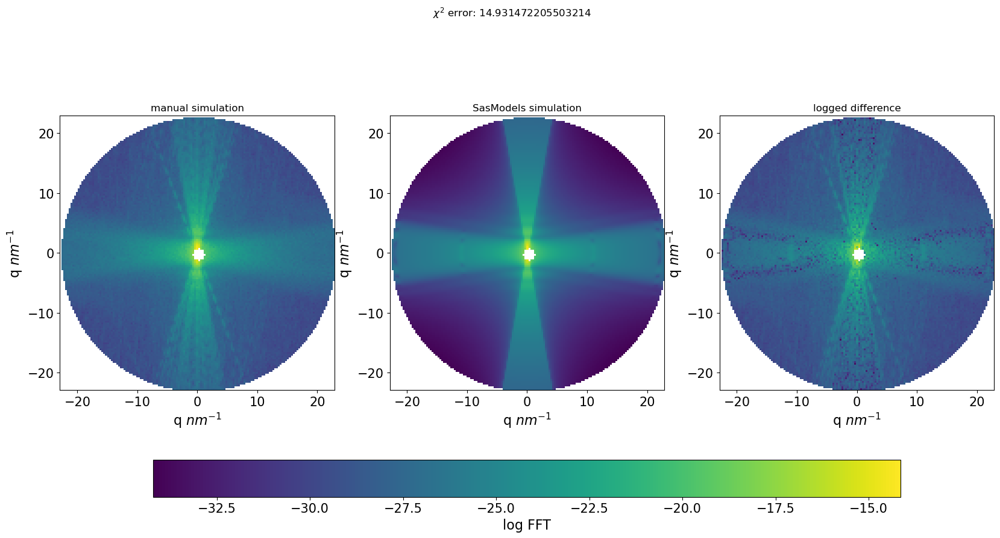

# Compute the forward and inverse problem in X-ray scattering

## Overview
This package implements computation for two problems,which can be found in SAXSsimulations directory:
1. Forward scattering `SAXSforward` - computes high-rsolution 3D Fourier Transform with low memory requirments
2. Inverse scattering `SAXSinverse` - given 1D scattering curve, predicts shape and parameters of the scatterer with an Invertible Neural Network[1], based on [2] Currentlu only three shapes are supported  


## References
[1] Ardizzone, L., Kruse, J., Wirkert, S., Rahner, D., Pellegrini, E.W., Klessen, R.S., Maier-Hein, L., Rother, C., Köthe, U., 2019. Analyzing Inverse Problems with Invertible Neural Networks. arXiv:1808.04730 [cs, stat].  
[2] Ardizzone, L., Bungert, T., Draxler, F., Köthe, U., Kruse, J., Schmier, R., and Sorrenson, 2018-2022. Framework for Easily Invertible Architectures (FrEIA). [https://github.com/vislearn/FrEIA]


## Requirments:


## Installation
```
$ git clone https://github.com/sofyalaski/SAXS-simulations.git
$ cd SAXS-simulations
$ pip install .
```

## `SAXSforward` usage examples (1)
Calculate 3D Fourier transform for some 3D density data.   
You will require mp-pyrho package and will first follow their tutorial on how to extract data from vasp files.  
an example density file is taken from [https://github.com/materialsproject/pyrho/tree/main/test_files] 


```python
import numpy as np
import torch
import requests
from pyrho.charge_density import ChargeDensity

import SAXSsimulations.SAXSforward as SAXSforward
from SAXSsimulations.SAXSforward.plotting import *

# save the vasp file locally
url = "https://raw.githubusercontent.com/materialsproject/pyrho/main/test_files/CHGCAR.sc1.vasp"
filename = "data/CHGCAR.sc1.vasp" # set the filename you want to save the file as

response = requests.get(url)

if response.status_code == 200:
    with open(filename, 'w') as f:
        f.write(response.text)
    print(f"File saved as {filename}")
else:
    print(f"Error downloading file. Status code: {response.status_code}")

# follow mp-pyrho tutorial
density = ChargeDensity.from_file(filename)
cden_transformed = density.get_transformed(
    [[1, 1, 0], [1, -1, 0], [0, 0, 1]],
    grid_out=density.grid_shape,
    up_sample=2,
)

trans_data = cden_transformed.normalized_data["total"]
print(
    f"The transformed normalized charge density data is has a range of {trans_data.min():0.3f} --> {trans_data.max():0.3f} e-/Ang^3 and a shape of {trans_data.shape }"
)
```

    File saved as data/CHGCAR.sc1.vasp
    The transformed normalized charge density data is has a range of -0.188 --> 0.570 e-/Ang^3 and a shape of (100, 60, 60)


To use the FT functions you need to create an instance of class `DensityData` from `SAXSforward` and assign the density values to the respective attribute with the methd `set_density`.  
Caution, pass data as a torch tensor. 


```python
# initialize the empty class with FT functionality and assign pre-calculated density attribute
density_f = SAXSforward.DensityData()
density_f.set_density(torch.tensor(trans_data))
```

### Warning
Do not plot the 3D plot if your data has a shape $>256^3$, instead plot the central slice in each direction with function `plot_slices_ft`


```python
# calculate the 3D FT with a custom function and plot it
density_f.pin_memory()
density_f.calculate_custom_FTI(three_d = True, device='cuda') # 3D FT
plot_3D_structure(density_f.FTI,  realspace = False, figsize = 5)
#plot_slices_ft(density_f)
```


    

    


## `SAXSforward` usage examples (2)
Or instead create a simulation by setting the size in nm and number of points in the box and calling a shape function. This will place spheres/ hard cpheres or cylinders into the box. You can also specify the parameters of the cylinder  
For better perfomance choose $2^a \times 3^b \times 5^c \times 7^d$ points in the box


```python
from SAXSsimulations.SAXSforward import  Sphere, Cylinder
# our box will contain 729**3 points and each axis represents 100 nm; spheres will be added until the taken volume fraction is 1%
simulation = Sphere(size = 100, nPoints = 729, volFrac = 0.01)
# spheres will have a radius of 3.4 nm and are allowed to overlap
simulation.place_shape(rMean = 3.4, nonoverlapping=False)
# look at it in 3D iN 5 evenly spaced slices
plot_slices(simulation.density, simulation.grid)
```

    spheres accepted:60 and declined: 0


    

    


Fourier transform it too:  
We can also set the arguments to output the memory it uses by setting `memory_stats` to True. Additionally, you can set the data type to be single or double precision by setting the `dtype` argument to either `torch.complex64` or `torch.complex128`. By default the single precision is set.  
Here we will look at 3D FT from the perspective of each axes central slice


```python
simulation.pin_memory()
memory_density, memory_ft = simulation.calculate_custom_FTI(three_d = True, device = 'cuda', memory_stats = True)
print(f'The memory requirments for the density matrix are {memory_density/1024**3}Gb, for calculating the FT: {memory_ft/1024**3}Gb')
# smooth out each pixel of simulation with *sinc* function and mask the FT to a sphere
simulation.calculate_FTI_sinc_masked()
# look at the 3D FT:
plot_slices_ft(simulation)
```

    The memory requirments for the density matrix are 3.68771679859492e-12Gb, for calculating the FT: 2.000888343900442e-11Gb


    

    


now rebin this into 1D curve ( only makes sense for high-resolution data)


```python
simulation.reBin(150, for_sas=True)
simulation.drop_first_bin()
plot_Q_vs_I(simulation.binned_slice, figsize = 5)
```


    

    


Fit our simulation against analytical solution generated with SasView


```python
# compare against SasView:
simulation.init_sas_model()
# fit the scaling factor to match
simulation.optimize_scaling()
# compare
plot_simulation_vs_sas( simulation)
```

    relative error: 0.75


    

    


Similarly do the same for cylinder:


```python
simulation = Cylinder(size = 100, nPoints = 729, volFrac = 0.01)
simulation.place_shape(rMean = 1.46, hMean = 21.4, theta = 10)
# look at the 2D maping of the cimulation from each perspective
plt_slices_sum(simulation)
```

    volume fraction is 0.01005, height is 15.308, radius is 1.503, center at (4.5,-25.1,-36.9), rotation phi is 264, rotation theta is 16 


    

    


```python
# calculate 3D FT and look at it
simulation.pin_memory()
simulation.calculate_custom_FTI(three_d = True, device = 'cuda')
plot_slices_ft(simulation)
```


    

    


rebin 3D FT, and fit against the analytical solution


```python
simulation.reBin(151)
simulation.init_sas_model()
simulation.optimize_scaling()

plot_simulation_vs_sas( simulation)
```

    relative error: 1.98


    

    


## Compute the inverse problem in scattering with `SAXSinverse`

Given a scattering curve in 1D infer the shape, radius, polydispersity and further parameters of the scatterer.   

A pretrained model is available in the results directory. Given a scattering curve with 512 points in it it can predict the shape (choice between "sphere", "hard sphere" and "cylinder"), radius and polydispersity of radius in nm' for shapes predicted to be hard spheres it will predict the volume fraction and for shapes predicted to be cylinders it will predict the length and polydispersity of cylinder.


In the `scripts/create_data.py` you can find functions for creating training data for the three shape. One can create more data with Sasmodels.   
However, when creating your training data keep in mind, that it should be balanced. 


```python

from SAXSsimulations.SAXSinverse.utils import ScatteringProblem
import numpy as np
import torch
import torch.nn as nn
import FrEIA.framework  as Ff
import FrEIA.modules as Fm

```

### Step 1: Define Hyperparameters


```python
#define some hyperparameters

# this parameters work when I/100
filename_out    = 'results/ML_output/inn.pt'
# Compute device to perform the training on, 'cuda' or 'cpu'
device          = 'cuda'

#######################
#  Training schedule  #
#######################

# Initial learning rate
lr_init         = 2e-3
#Batch size
batch_size      = 128
# Total number of epochs to train for
n_epochs        = 200

# End the epoch after this many iterations (or when the train loader is exhausted)
n_its_per_epoch = 200
# For the first n epochs, train with a much lower learning rate. This can be
# helpful if the model immediately explodes.
pre_low_lr      = 0
# Decay exponentially each epoch, to final_decay*lr_init at the last epoch.
final_decay     = 0.02
# L2 weight regularization of model parameters
l2_weight_reg   = 1e-5
# Parameters beta1, beta2 of the Adam optimizer
adam_betas = (0.9, 0.95)

#####################
#  Data dimensions  #
#####################
ndim_pad_x = 522

ndim_y     = 512
ndim_z     = 2
ndim_pad_zy = 18 


############
#  Losses  #
############

train_reconstruction = False


lambd_fit_forw         = 0.01 
lambd_mmd_forw         = 100
lambd_mmd_back         = 500
lambd_reconstruct      = 1.

# Both for fitting, and for the reconstruction, perturb y with Gaussian 
# noise of this sigma
add_y_noise     = 0 
# For reconstruction, perturb z 
add_z_noise     = 2e-2
# In all cases, perturb the zero padding
add_pad_noise   = 1e-2

# For noisy forward processes, the sigma on y (assumed equal in all dimensions).
# This is only used if mmd_back_weighted of train_max_likelihoiod are True.
y_uncertainty_sigma = 0.12 * 4


mmd_forw_kernels = [(0.2, 1/2), (1.5, 1/2), (3.0, 1/2)]
mmd_back_kernels = [(0.2, 1/2), (0.2, 1/2), (0.2, 1/2)]
mmd_back_weighted = True

###########
#  Model  #
###########

# Initialize the model parameters from a normal distribution with this sigma
init_scale = 0.10
# n blocks in the RNVP
N_blocks   = 5
#
exponent_clamping = 2
#
hidden_layer_sizes = 32
#
use_permutation = True
#
verbose_construction = False
# the flow of the network
flow = 'inverse'

```

### Step 2: Create instance of the class


```python
# define instance of the class
lp = ScatteringProblem(filename_out, device, lr_init, batch_size, n_epochs, n_its_per_epoch, pre_low_lr, final_decay, l2_weight_reg, adam_betas, ndim_pad_x, ndim_y, ndim_z, ndim_pad_zy , train_reconstruction, lambd_fit_forw , 
                       lambd_mmd_forw, lambd_mmd_back, lambd_reconstruct, add_y_noise , add_z_noise, add_pad_noise, y_uncertainty_sigma,mmd_forw_kernels, mmd_back_kernels, mmd_back_weighted, init_scale, flow)
```

### Step 3: Read the data you will be predicting and Normalize data


When reading in the data you need to pass a path to directory where the training data in HDF format is contained, the total number of shapes the training data contains and the list with names of all parameters as in the HDFs. 
Addiionally, the first two parameters MUST be shapes and radius as they are present in all shapes andare most ambigous. They will be represented as one-hot data.  


```python

lp.read_data('data/simulations',shapes = 3, input_keys = ['shape', 'radius', 'radius_pd','length', 'length_pd',  'volfraction'])
lp.normalize_inputs()

```

    <HDF5 file "15000.nxs" (mode r)>

### Step 4: Define model


```python
def subnet(dims_in, dims_out):
    return nn.Sequential(nn.Linear(dims_in, hidden_layer_sizes*2), nn.ReLU(),
                        nn.Linear(hidden_layer_sizes*2,  hidden_layer_sizes), nn.ReLU(),
                        nn.Linear(hidden_layer_sizes,  dims_out))

input = Ff.InputNode(lp.ndim_x + ndim_pad_x, name='input')


nodes = [input]
for i in range(N_blocks):
    nodes.append(Ff.Node(nodes[-1].out0, Fm.RNVPCouplingBlock, {'subnet_constructor':subnet, 'clamp':exponent_clamping}, name = 'coupling_{}'.format(i)))
    if use_permutation:
        nodes.append(Ff.Node([nodes[-1].out0], Fm.PermuteRandom, {'seed':i}, name='permute_{}'.format(i)))

nodes.append(Ff.OutputNode([nodes[-1].out0], name='output'))
model = Ff.GraphINN(nodes, verbose=verbose_construction)
```

### Step 5: Set the model and the optimizer 


```python

lp.set_model(model)
lp.set_optimizer()
```

### Step 6: Load the pretrained model


```python

lp.load(filename_out)
```

### Step 7: Predict outcomes;
we  first will create some subset of the data to predict the data on 


```python
subset = torch.tensor(np.random.choice(15000, 200))
scattering_curves = torch.index_select(lp.labels, 0, subset) 
scatterers = torch.index_select(lp.inputs, 0, subset) 
```


```python
predictions = lp.predict(scattering_curves, 3)
```


```python
outcomes = lp.create_table_from_outcomes(predictions, scatterers)
```


```python
# some visualization methods
from SAXSsimulations.SAXSinverse.visualizations import plot_outcomes_identified, describe_false_shapes, describe_positive_shapes
```


```python
plot_outcomes_identified(outcomes, 'test', path = None)
```

    Accuracy is 95.00%
    [87.5, 96.92307692307692, 100.0]
    MSE for radius per shape for correctly identified instances as follows: sphere: 0.1366, hardsphere: 0.1310 and cylinder: 0.0828
    MSE for radius polydispersity per shape for correctly identified instances as follows: sphere: 1.0337, hardsphere: 0.9653 and cylinder: 0.0002
    MSE for cylinder length for correctly identified instances: 0.0002
    MSE for cylinder length polydispersity for correctly identified instances: 0.0002
    MSE for cylinder length for correctly identified instances: 0.9653


    ---------------------------------------------------------------------------

    ValueError                                Traceback (most recent call last)

    File ~/.conda/envs/ma/lib/python3.9/site-packages/IPython/core/formatters.py:339, in BaseFormatter.__call__(self, obj)
        337     pass
        338 else:
    --> 339     return printer(obj)
        340 # Finally look for special method names
        341 method = get_real_method(obj, self.print_method)


    File ~/.conda/envs/ma/lib/python3.9/site-packages/IPython/core/pylabtools.py:151, in print_figure(fig, fmt, bbox_inches, base64, **kwargs)
        148     from matplotlib.backend_bases import FigureCanvasBase
        149     FigureCanvasBase(fig)
    --> 151 fig.canvas.print_figure(bytes_io, **kw)
        152 data = bytes_io.getvalue()
        153 if fmt == 'svg':


    File ~/.conda/envs/ma/lib/python3.9/site-packages/matplotlib/backend_bases.py:2338, in FigureCanvasBase.print_figure(self, filename, dpi, facecolor, edgecolor, orientation, format, bbox_inches, pad_inches, bbox_extra_artists, backend, **kwargs)
       2334 try:
       2335     # _get_renderer may change the figure dpi (as vector formats
       2336     # force the figure dpi to 72), so we need to set it again here.
       2337     with cbook._setattr_cm(self.figure, dpi=dpi):
    -> 2338         result = print_method(
       2339             filename,
       2340             facecolor=facecolor,
       2341             edgecolor=edgecolor,
       2342             orientation=orientation,
       2343             bbox_inches_restore=_bbox_inches_restore,
       2344             **kwargs)
       2345 finally:
       2346     if bbox_inches and restore_bbox:


    File ~/.conda/envs/ma/lib/python3.9/site-packages/matplotlib/backend_bases.py:2204, in FigureCanvasBase._switch_canvas_and_return_print_method.<locals>.<lambda>(*args, **kwargs)
       2200     optional_kws = {  # Passed by print_figure for other renderers.
       2201         "dpi", "facecolor", "edgecolor", "orientation",
       2202         "bbox_inches_restore"}
       2203     skip = optional_kws - {*inspect.signature(meth).parameters}
    -> 2204     print_method = functools.wraps(meth)(lambda *args, **kwargs: meth(
       2205         *args, **{k: v for k, v in kwargs.items() if k not in skip}))
       2206 else:  # Let third-parties do as they see fit.
       2207     print_method = meth


    File ~/.conda/envs/ma/lib/python3.9/site-packages/matplotlib/_api/deprecation.py:410, in delete_parameter.<locals>.wrapper(*inner_args, **inner_kwargs)
        400     deprecation_addendum = (
        401         f"If any parameter follows {name!r}, they should be passed as "
        402         f"keyword, not positionally.")
        403     warn_deprecated(
        404         since,
        405         name=repr(name),
       (...)
        408                  else deprecation_addendum,
        409         **kwargs)
    --> 410 return func(*inner_args, **inner_kwargs)


    File ~/.conda/envs/ma/lib/python3.9/site-packages/matplotlib/backends/backend_agg.py:520, in FigureCanvasAgg.print_png(self, filename_or_obj, metadata, pil_kwargs, *args)
        471 @_api.delete_parameter("3.5", "args")
        472 def print_png(self, filename_or_obj, *args,
        473               metadata=None, pil_kwargs=None):
        474     """
        475     Write the figure to a PNG file.
        476 
       (...)
        518         *metadata*, including the default 'Software' key.
        519     """
    --> 520     self._print_pil(filename_or_obj, "png", pil_kwargs, metadata)


    File ~/.conda/envs/ma/lib/python3.9/site-packages/matplotlib/backends/backend_agg.py:466, in FigureCanvasAgg._print_pil(self, filename_or_obj, fmt, pil_kwargs, metadata)
        461 def _print_pil(self, filename_or_obj, fmt, pil_kwargs, metadata=None):
        462     """
        463     Draw the canvas, then save it using `.image.imsave` (to which
        464     *pil_kwargs* and *metadata* are forwarded).
        465     """
    --> 466     FigureCanvasAgg.draw(self)
        467     mpl.image.imsave(
        468         filename_or_obj, self.buffer_rgba(), format=fmt, origin="upper",
        469         dpi=self.figure.dpi, metadata=metadata, pil_kwargs=pil_kwargs)


    File ~/.conda/envs/ma/lib/python3.9/site-packages/matplotlib/backends/backend_agg.py:402, in FigureCanvasAgg.draw(self)
        400 def draw(self):
        401     # docstring inherited
    --> 402     self.renderer = self.get_renderer()
        403     self.renderer.clear()
        404     # Acquire a lock on the shared font cache.


    File ~/.conda/envs/ma/lib/python3.9/site-packages/matplotlib/_api/deprecation.py:384, in delete_parameter.<locals>.wrapper(*inner_args, **inner_kwargs)
        379 @functools.wraps(func)
        380 def wrapper(*inner_args, **inner_kwargs):
        381     if len(inner_args) <= name_idx and name not in inner_kwargs:
        382         # Early return in the simple, non-deprecated case (much faster than
        383         # calling bind()).
    --> 384         return func(*inner_args, **inner_kwargs)
        385     arguments = signature.bind(*inner_args, **inner_kwargs).arguments
        386     if is_varargs and arguments.get(name):


    File ~/.conda/envs/ma/lib/python3.9/site-packages/matplotlib/backends/backend_agg.py:419, in FigureCanvasAgg.get_renderer(self, cleared)
        417 reuse_renderer = (self._lastKey == key)
        418 if not reuse_renderer:
    --> 419     self.renderer = RendererAgg(w, h, self.figure.dpi)
        420     self._lastKey = key
        421 elif cleared:


    File ~/.conda/envs/ma/lib/python3.9/site-packages/matplotlib/backends/backend_agg.py:87, in RendererAgg.__init__(self, width, height, dpi)
         85 self.width = width
         86 self.height = height
    ---> 87 self._renderer = _RendererAgg(int(width), int(height), dpi)
         88 self._filter_renderers = []
         90 self._update_methods()


    ValueError: Image size of 1217x150971 pixels is too large. It must be less than 2^16 in each direction.


    <Figure size 1400x700 with 6 Axes>


## Alternatively you can train your own model. For that you will need to add some additional steps:
* Step 3.5 create loaders
* Step 6 training the model


```python
lp = ScatteringProblem(filename_out, device, lr_init, batch_size, n_epochs, n_its_per_epoch, pre_low_lr, final_decay, l2_weight_reg, adam_betas, ndim_pad_x, ndim_y, ndim_z, ndim_pad_zy , train_reconstruction, lambd_fit_forw , 
                       lambd_mmd_forw, lambd_mmd_back, lambd_reconstruct, add_y_noise , add_z_noise, add_pad_noise, y_uncertainty_sigma,mmd_forw_kernels, mmd_back_kernels, mmd_back_weighted, init_scale, flow)


lp.read_data('data/simulations',shapes = 3, input_keys = ['shape', 'radius', 'radius_pd','length', 'length_pd',  'volfraction'])
lp.normalize_inputs()
#new
lp.create_loaders()


lp.set_model(model)
lp.set_optimizer()
lp.train()
```

    Epoch            L_fit       L_mmd_fwd      L_mmd_back       L_reconst     L_fit(test) L_mmd_fwd(test) L_mmd_back(test) L_reconst(test)
       000          4.7348          0.8695          1.2205          3.8518          0.7472          1.2199
       001          3.7097          0.7024          1.2135          3.4574          0.6944          1.1999
       002          3.3311          0.6498          1.1704          3.6885          0.6255          1.1380
       003          3.1563          0.6216          1.1189          3.2186          0.6196          1.0964
       004          3.0399          0.6026          1.0777          2.9338          0.5979          1.0695
       005          2.9972          0.5924          1.0550          2.8500          0.6026          1.0378
       006          3.0414          0.5903          1.0390          3.3051          0.6026          1.0233
       007          2.7379          0.5914          1.0197          3.0367          0.6026          1.0160
       008          2.9202          0.5831          1.0187          2.9073          0.5864          1.0044
       009          2.8448          0.5792          1.0146          2.7556          0.5823          0.9951
       010          2.8521          0.5848          1.0024          3.5093          0.5968          0.9991
       011          2.9779          0.5725          1.0080          2.4734          0.5694          0.9890
       012          2.6216          0.5653          0.9868          2.4131          0.5627          0.9709
       013          2.6423          0.5643          0.9912          2.8029          0.5610          0.9753
       014          2.7128          0.5675          0.9852          2.6821          0.5681          0.9686
       015          2.5979          0.5574          0.9836          2.7552          0.5599          0.9760
       016          2.5706          0.5555          0.9891          2.7303          0.5582          0.9830
       017          2.8621          0.5595          0.9825          2.6802          0.5631          0.9675
       018          2.6105          0.5609          0.9873          2.7027          0.5603          0.9608
       019          2.3459          0.5537          0.9641          2.2507          0.5552          0.9579
       020          2.3382          0.5558          0.9677          2.5031          0.5671          0.9522
       021          2.4542          0.5589          0.9778          2.6329          0.5615          0.9621
       022          2.5271          0.5486          0.9844          2.6679          0.5544          1.0017
       023          2.5301          0.5574          0.9721          2.6885          0.5515          0.9607
       024          2.5251          0.5545          0.9665          2.4191          0.5552          0.9644
       025          2.2919          0.5464          0.9614          2.0116          0.5448          0.9523
       026          2.4615          0.5485          0.9597          2.6760          0.5477          0.9796
       027          2.4302          0.5484          0.9653          2.6618          0.5517          0.9534
       028          2.4711          0.5458          0.9553          2.4087          0.5578          0.9544
       029          2.5464          0.5459          0.9584          2.3364          0.5459          0.9472
       030          2.4255          0.5492          0.9540          2.3044          0.5453          0.9560
       031          2.1166          0.5444          0.9566          2.3838          0.5439          0.9456
       032          2.3561          0.5453          0.9541          2.2812          0.5483          0.9427
       033          2.4211          0.5460          0.9552          2.2117          0.5425          0.9725
       034          2.4198          0.5405          0.9551          2.0418          0.5502          0.9408
       035          2.2892          0.5419          0.9503          2.6625          0.5673          0.9496
       036          2.2488          0.5416          0.9524          2.2375          0.5321          0.9445
       037          2.2842          0.5387          0.9546          2.1210          0.5498          0.9421
       038          2.2686          0.5418          0.9524          2.1328          0.5488          0.9507
       039          2.3619          0.5414          0.9550          2.3128          0.5442          0.9452
       040          2.0812          0.5376          0.9511          2.2032          0.5492          0.9409
       041          2.1119          0.5430          0.9459          2.4448          0.5480          0.9764
       042          2.3830          0.5461          0.9544          2.0804          0.5481          0.9507
       043          2.2943          0.5401          0.9537          2.1337          0.5589          0.9525
       044          2.2435          0.5368          0.9535          2.2840          0.5375          0.9458
       045          2.2423          0.5416          0.9512          1.9307          0.5489          0.9535
       046          2.3066          0.5407          0.9567          2.4158          0.5537          0.9307
       047          2.0930          0.5412          0.9457          2.3662          0.5554          0.9421
       048          2.3275          0.5381          0.9480          2.6686          0.5451          0.9433
       049          2.2767          0.5374          0.9497          2.3788          0.5442          0.9350
       050          2.0217          0.5347          0.9361          2.2008          0.5420          0.9302
       051          2.1376          0.5360          0.9389          2.2249          0.5407          0.9256
       052          2.3586          0.5368          0.9452          1.9939          0.5361          0.9350
       053          2.1859          0.5330          0.9347          2.1452          0.5352          0.9368
       054          2.0306          0.5360          0.9335          1.7863          0.5416          0.9240
       055          2.1713          0.5368          0.9352          2.6457          0.5488          0.9421
       056          2.3392          0.5380          0.9541          2.3000          0.5448          0.9613
       057          2.1481          0.5353          0.9411          2.0865          0.5445          0.9569
       058          1.9093          0.5358          0.9426          2.2618          0.5407          0.9261
       059          2.0847          0.5352          0.9319          2.4467          0.5401          0.9130
       060          2.1307          0.5347          0.9321          2.3295          0.5381          0.9307
       061          1.9765          0.5356          0.9280          1.8254          0.5401          0.9488
       062          2.2539          0.5343          0.9270          2.0641          0.5490          0.9271
       063          1.9879          0.5350          0.9308          1.9980          0.5331          0.9255
       064          2.0800          0.5331          0.9327          2.5555          0.5306          0.9233
       065          2.1074          0.5321          0.9240          2.6378          0.5352          0.9135
       066          2.1778          0.5326          0.9325          2.0983          0.5312          0.8923
       067          1.9342          0.5298          0.9275          2.0079          0.5330          0.8939
       068          2.0328          0.5343          0.9316          2.2020          0.5371          0.9197
       069          2.0530          0.5310          0.9201          2.2664          0.5421          0.9393
       070          2.0670          0.5329          0.9409          1.7195          0.5247          0.9306
       071          1.9759          0.5303          0.9255          2.2505          0.5333          0.9203
       072          2.2672          0.5287          0.9396          1.8786          0.5319          0.9160
       073          2.0161          0.5301          0.9326          2.1580          0.5339          0.9146
       074          1.9384          0.5292          0.9257          2.1282          0.5285          0.9234
       075          2.0621          0.5285          0.9281          2.3392          0.5340          0.9307
       076          2.1100          0.5295          0.9250          1.8680          0.5376          0.9104
       077          1.8626          0.5244          0.9123          2.2208          0.5234          0.9228
       078          2.1717          0.5272          0.9283          2.7255          0.5316          0.9472
       079          2.0202          0.5280          0.9398          2.0269          0.5225          0.9234
       080          1.9096          0.5275          0.9005          2.1242          0.5290          0.8987
       081          1.8687          0.5244          0.9212          1.8031          0.5229          0.9214
       082          2.1535          0.5265          0.9092          2.4291          0.5253          0.9486
       083          2.2432          0.5283          0.9085          2.3870          0.5291          0.8845
       084          2.0847          0.5213          0.9149          2.3023          0.5252          0.9050
       085          1.9805          0.5277          0.9256          2.0245          0.5272          0.9078
       086          1.9993          0.5289          0.9154          2.2170          0.5299          0.8877
       087          2.0651          0.5318          0.9106          1.9423          0.5209          0.9013
       088          2.0447          0.5279          0.8957          2.0355          0.5288          0.8900
       089          1.9646          0.5279          0.9186          1.9392          0.5372          0.9068
       090          1.8111          0.5240          0.8993          2.0405          0.5209          0.9054
       091          1.9653          0.5304          0.8955          2.2955          0.5277          0.9218
       092          2.0421          0.5256          0.9074          1.7633          0.5327          0.8871
       093          1.8786          0.5256          0.8965          2.0928          0.5309          0.8952
       094          1.8542          0.5249          0.8952          1.7881          0.5244          0.9001
       095          1.9456          0.5283          0.8902          2.1125          0.5296          0.8993
       096          2.0106          0.5288          0.8918          2.0973          0.5336          0.9000
       097          2.0506          0.5245          0.8970          2.1319          0.5287          0.8967
       098          1.9976          0.5266          0.8986          2.0157          0.5230          0.8650
       099          1.8964          0.5249          0.8940          1.8022          0.5285          0.9280
       100          2.2526          0.5312          0.9271          2.4215          0.5403          0.9576
       101          2.0400          0.5299          0.9242          1.9731          0.5296          0.9011
       102          1.9307          0.5239          0.8939          1.7463          0.5231          0.8745
       103          1.8928          0.5248          0.8878          2.0850          0.5309          0.8974
       104          1.7833          0.5292          0.8865          1.6568          0.5318          0.8751
       105          2.0373          0.5233          0.8771          1.9892          0.5359          0.8573
       106          1.8858          0.5247          0.8605          1.6476          0.5189          0.8467
       107          1.7290          0.5175          0.8628          2.0382          0.5215          0.9109
       108          1.9878          0.5221          0.8817          2.3453          0.5301          0.8916
       109          1.9824          0.5230          0.8607          1.6499          0.5153          0.8495
       110          1.8789          0.5210          0.8627          1.9787          0.5300          0.8564
       111          1.8213          0.5182          0.8706          1.7068          0.5224          0.8698
       112          1.9475          0.5184          0.8693          1.8586          0.5137          0.8581
       113          1.9566          0.5201          0.8720          2.1411          0.5244          0.8740
       114          1.7853          0.5183          0.8651          2.0049          0.5216          0.8915
       115          1.8532          0.5198          0.8602          2.2482          0.5177          0.8451
       116          1.9068          0.5182          0.8594          1.9537          0.5176          0.8634
       117          1.9526          0.5210          0.8689          2.2598          0.5243          0.8794
       118          1.8499          0.5235          0.8871          2.1720          0.5186          0.9256
       119          1.8054          0.5185          0.8687          1.7868          0.5288          0.8823
       120          1.7089          0.5201          0.8738          1.8596          0.5308          0.9098
       121          1.8781          0.5200          0.8810          1.7887          0.5294          0.8372
       122          1.7781          0.5178          0.8757          1.9891          0.5194          0.8950
       123          1.8419          0.5162          0.8579          1.9541          0.5157          0.8334
       124          1.6904          0.5142          0.8519          1.7389          0.5134          0.8505
       125          1.9348          0.5158          0.8691          2.2237          0.5221          0.8728
       126          1.8003          0.5194          0.8443          2.1968          0.5172          0.8254
       127          1.8161          0.5170          0.8556          1.7847          0.5135          0.8614
       128          1.7885          0.5162          0.8625          2.2370          0.5253          0.8555
       129          1.7407          0.5120          0.8336          1.7525          0.5100          0.8721
       130          2.0130          0.5184          0.8596          1.9655          0.5229          0.8387
       131          1.6976          0.5172          0.8379          1.7511          0.5135          0.8041
       132          1.7912          0.5155          0.8472          1.9201          0.5294          0.8308
       133          1.7915          0.5183          0.8458          2.0273          0.5202          0.8836
       134          1.9768          0.5124          0.8475          2.2908          0.5129          0.8874
       135          1.8040          0.5152          0.8610          2.0058          0.5144          0.8780
       136          1.7862          0.5126          0.8519          1.7094          0.5115          0.7860
       137          1.7348          0.5181          0.8412          1.8289          0.5192          0.8325
       138          1.7224          0.5141          0.8356          1.7790          0.5098          0.8220
       139          1.7554          0.5153          0.8564          2.0232          0.5122          0.8597
       140          1.7013          0.5117          0.8283          1.9457          0.5200          0.8089
       141          1.8423          0.5139          0.8441          1.5857          0.5175          0.8049
       142          1.7684          0.5168          0.8600          1.9585          0.5151          0.8166
       143          1.7943          0.5144          0.8360          1.5918          0.5231          0.8557
       144          1.8578          0.5185          0.8540          2.1544          0.5440          0.8697
       145          2.1297          0.5231          0.8517          2.0443          0.5128          0.8236
       146          1.6004          0.5113          0.8422          2.2494          0.5149          0.8854
       147          1.8000          0.5171          0.8480          1.9127          0.5225          0.8213
       148          1.8263          0.5177          0.8517          2.0155          0.5176          0.8606
       149          1.7417          0.5143          0.8285          1.8414          0.5128          0.8314
       150          1.9298          0.5141          0.8729          1.8721          0.5146          0.8440
       151          1.6585          0.5137          0.8519          1.9617          0.5122          0.8297
       152          1.7365          0.5129          0.8171          1.9952          0.5037          0.7969
       153          1.6380          0.5134          0.8485          2.0873          0.5155          0.8563
       154          1.6406          0.5143          0.8540          1.8695          0.5165          0.8314
       155          2.4750          0.5209          0.8921          2.2863          0.5365          0.9131
       156          1.9715          0.5356          0.8882          2.0248          0.5333          0.8615
       157          2.0363          0.5258          0.8780          2.0809          0.5276          0.8413
       158          1.7090          0.5238          0.8429          1.8008          0.5194          0.8179
       159          1.8733          0.5221          0.8699          1.8444          0.5275          0.8723
       160          1.8480          0.5202          0.8517          1.9251          0.5183          0.8327
       161          1.7121          0.5169          0.8333          2.2169          0.5195          0.8459
       162          1.7176          0.5175          0.8555          1.8231          0.5198          0.8377
       163          1.7682          0.5194          0.8240          1.9063          0.5214          0.8438
       164          1.5520          0.5170          0.8443          1.5939          0.5149          0.8219
       165          1.6979          0.5132          0.8606          2.0002          0.5187          0.9381
       166          1.5572          0.5138          0.8565          1.8115          0.5163          0.8067
       167          1.8502          0.5186          0.8368          1.6326          0.5142          0.8812
       168          1.7956          0.5139          0.8317          2.1432          0.5194          0.8303
       169          1.7699          0.5141          0.8164          1.9650          0.5119          0.8263
       170          1.8782          0.5124          0.8109          1.8973          0.5142          0.8155
       171          1.7452          0.5129          0.8505          1.8445          0.5198          0.7987
       172          1.8096          0.5156          0.8338          1.6403          0.5086          0.7894
       173          1.7501          0.5080          0.7866          2.0631          0.5118          0.7709
       174          1.7481          0.5140          0.8128          1.6614          0.5109          0.8932
       175          1.7998          0.5126          0.8373          1.8810          0.5100          0.8263
       176          1.4489          0.5069          0.8025          1.6987          0.5072          0.7793
       177          1.6744          0.5099          0.8276          1.8754          0.5161          0.8920
       178          1.8849          0.5125          0.8072          2.0694          0.5215          0.7893
       179          1.5679          0.5095          0.8052          1.7887          0.5150          0.8020
       180          1.6977          0.5135          0.8068          1.8361          0.5229          0.7744
       181          1.6655          0.5098          0.7995          1.7360          0.5015          0.8163
       182          1.7438          0.5093          0.8404          1.7527          0.5177          0.8361
       183          1.7068          0.5126          0.8118          1.4321          0.5111          0.8111
       184          1.4380          0.5092          0.8037          1.6640          0.5067          0.7712
       185          1.6492          0.5113          0.8335          1.8347          0.5133          0.8545
       186          1.7769          0.5113          0.8181          1.6459          0.5019          0.8641
       187          1.7343          0.5062          0.8018          1.6837          0.5077          0.8514
       188          1.7073          0.5063          0.8017          1.7992          0.5186          0.7928
       189          1.5934          0.5090          0.7864          1.8079          0.5108          0.8676
       190          1.6410          0.5156          0.8297          2.1264          0.5149          0.8228
       191          1.7401          0.5177          0.8021          1.6562          0.5146          0.8327
       192          1.5894          0.5085          0.7844          1.5895          0.5114          0.7881
       193          1.5346          0.5077          0.7856          1.5789          0.5048          0.7767
       194          1.8965          0.5134          0.8163          1.6856          0.5090          0.7965
       195          1.8187          0.5083          0.8434          1.8210          0.5215          0.8199
       196          1.6777          0.5087          0.8225          1.8044          0.5267          0.8395
       197          1.7718          0.5112          0.8349          1.6148          0.5179          0.8247
       198          1.4855          0.5075          0.8381          1.5752          0.5126          0.8695
       199          1.5918          0.5134          0.8479          1.6625          0.5105          0.8380
    
    
    Training took 19.622087 minutes
    
    

